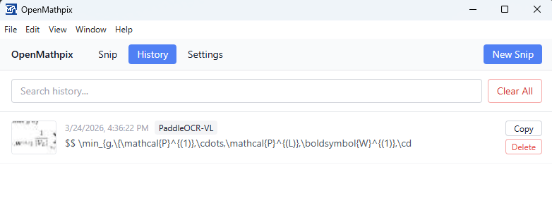

<p align="center">
  
</p>

<h1 align="center">OpenMathpix (Enhanced)</h1>

<p align="center">
  <a href="README_CN.md">简体中文</a> | <b>English</b>
</p>

<p align="center">
  Open-source desktop snipping tool that captures screen regions and converts math formulas, tables, text into LaTeX, Markdown, or plain text — powered by <a href="https://github.com/PaddlePaddle/PaddleOCR">PaddleOCR</a> on Baidu AIStudio.
</p>

---

## Enhanced Features

This repository includes several key enhancements over the original OpenMathpix:
1. **PaddleOCR API V2 Support**: Fully compatible with Baidu AIStudio's V2 asynchronous job polling (`/jobs` endpoint). Supports newer models like **PaddleOCR-VL-1.6**.
2. **Robust Clipboard Operations**: Rewritten copy mechanism using Electron IPC through the main process, bypassing browser/renderer security policies that cause `Cannot read properties of undefined (reading 'writeText')` or `Document is not focused` when the window loses focus.
3. **Inline Base64 Markdown Images**: Images parsed in the Markdown output are automatically downloaded and converted to inline Base64 data URIs (`data:image/...;base64,...`). This allows you to copy and paste structured layouts straight into editors like Obsidian or Typora without broken local image links.

---

## Installation

### Build from source

```bash
git clone git@github.com:JhuoW/OpenMathpix.git
cd OpenMathpix
npm install
npm run dev        
# Build application package
npm run package    
```

## Getting started

### Step 1: Get your API credentials

1. Go to [https://aistudio.baidu.com/paddleocr](https://aistudio.baidu.com/paddleocr) and log in (or create a free Baidu AIStudio account).
2. Click **"API"** button to access the model list. Then select a model (e.g. PaddleOCR-VL) to reveal the example code and your unique API URL and Access Token.

<div align="center">
  
</div>
3. Copy these two values from the example:

- **API URL** — your unique endpoint, e.g. `https://xxxxxx.aistudio-app.com/layout-parsing`
- **Access Token** — your authentication token (also at [https://aistudio.baidu.com/index/accessToken](https://aistudio.baidu.com/index/accessToken))

> **Note:** Each model gets its own API URL (different subdomain). If you switch models, copy the new URL too.

### Step 2: Configure OpenMathpix

1. Launch OpenMathpix.
2. Click **Settings** in the toolbar.
3. Under **API Configuration**:
   - Paste your **API URL**.
   - Paste your **Access Token**.
   - Select a **Pipeline** that matches the model you chose on AIStudio.
4. Click **Test Connection** to verify.
<div align="center">
  
</div>

### Step 3: Capture and recognize

#### Screen snip
You can click **Snip** button in the toolbar and then click **New Snip** button to dim the screen. 
<div align="center">
  
</div>

You can click and drag to select a region. Release to capture.
<div align="center">
  
  
</div>

## Viewing results

After recognition, results appear in four tabs:

| Tab                | Description                                                  |
| ------------------ | ------------------------------------------------------------ |
| **LaTeX**    | Extracted math rendered via KaTeX, with copyable raw source. |
| **Markdown** | Structured output (headings, tables, inline math).           |
| **Text**     | Plain text with all formatting stripped.                     |
| **Image**    | The original captured screenshot.                            |

Click **Copy** to copy the active tab. The default format is auto-copied after each recognition.

## Pipelines

| Pipeline                   | Best for                               | Output           |
| -------------------------- | -------------------------------------- | ---------------- |
| **PP-OCRv5**         | General text (CJK + English)           | Text only        |
| **PP-StructureV3**   | Math, tables, charts, mixed layout     | Markdown + LaTeX |
| **PaddleOCR-VL**     | Vision-language document parsing       | Markdown + LaTeX |
| **PaddleOCR-VL-1.5** | Higher accuracy, seal & irregular text | Markdown + LaTeX |
| **PaddleOCR-VL-1.6** | Latest multimodal document parser      | Markdown + LaTeX |

> Each pipeline has its own API URL on AIStudio. When switching pipelines, update the URL in Settings to match.

## Settings

| Setting        | Default          | Description                               |
| -------------- | ---------------- | ----------------------------------------- |
| API URL        | —               | Your PaddleOCR AIStudio endpoint.         |
| Access Token   | —               | Stored encrypted on disk via safeStorage. |
| Pipeline       | PP-StructureV3   | Which OCR pipeline to use.                |
| Snip Hotkey    | `Ctrl+Shift+S` | Global shortcut for screen capture.       |
| Default Output | LaTeX            | Format auto-copied after recognition.     |
| Theme          | System           | Light / Dark / System.                    |
| History Limit  | 100              | Max saved recognitions (10–500).         |

**Self-hosted:** Set the API URL to your local server (e.g. `http://localhost:8080`) and leave the token empty.

## History

Click **History** in the toolbar to browse past recognitions. Each entry shows a thumbnail, timestamp, and preview. Use the search bar to filter, or click an entry to re-open its result.
<div align="center">
  
</div>

## System tray

Closing the window minimizes to tray. Right-click the tray icon for:

- **Snip** — start capture
- **Open Window** — show main window
- **Settings** — open settings
- **Quit** — exit

## Keyboard shortcuts

| Shortcut                           | Action                      |
| ---------------------------------- | --------------------------- |
| `Ctrl+Shift+S`| Screen snip (global)        |
| `Ctrl+V` | Paste image for recognition |
| `Escape`  | Cancel snip                 |

## License

MIT
