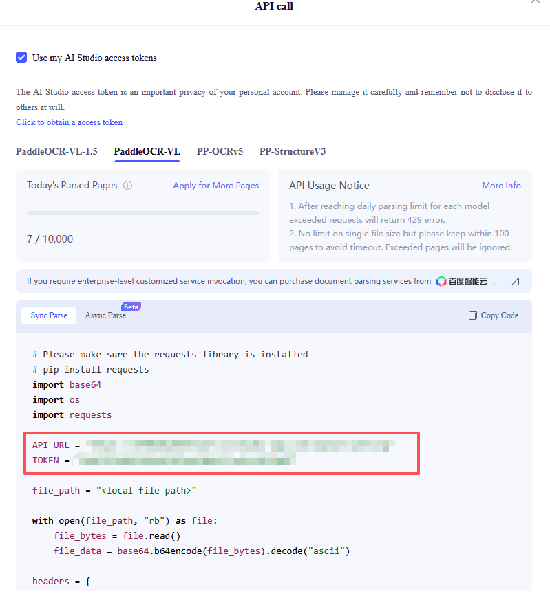
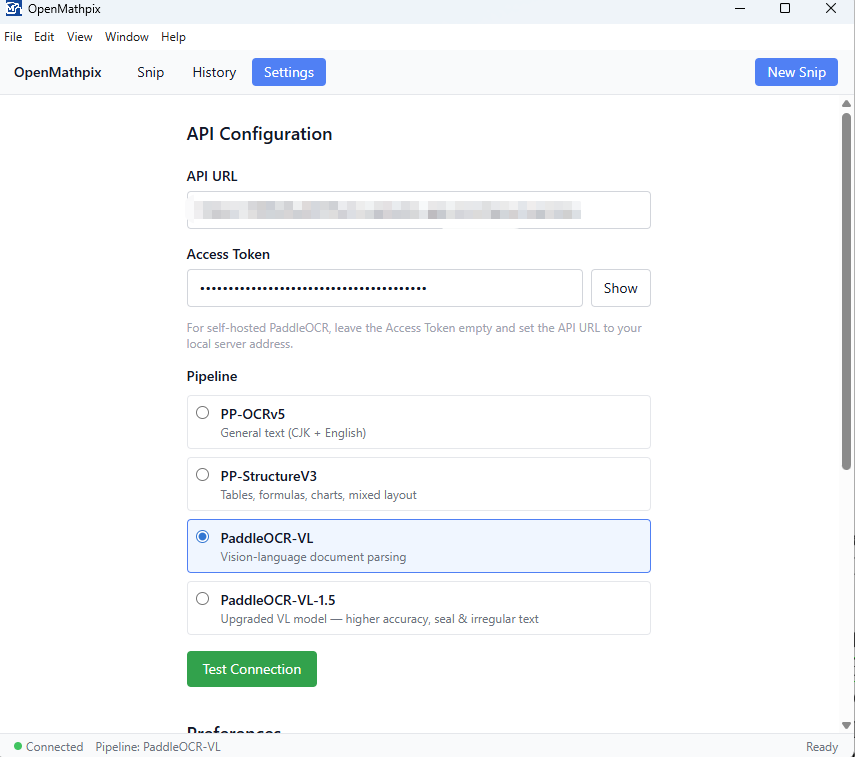
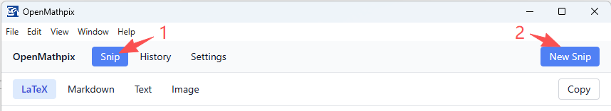
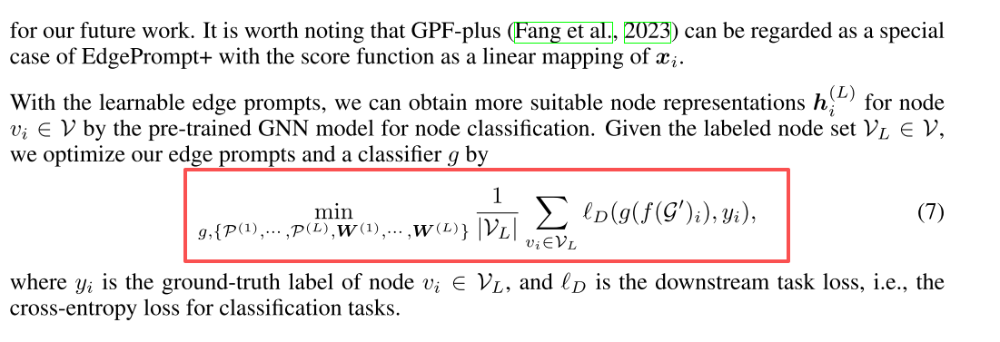
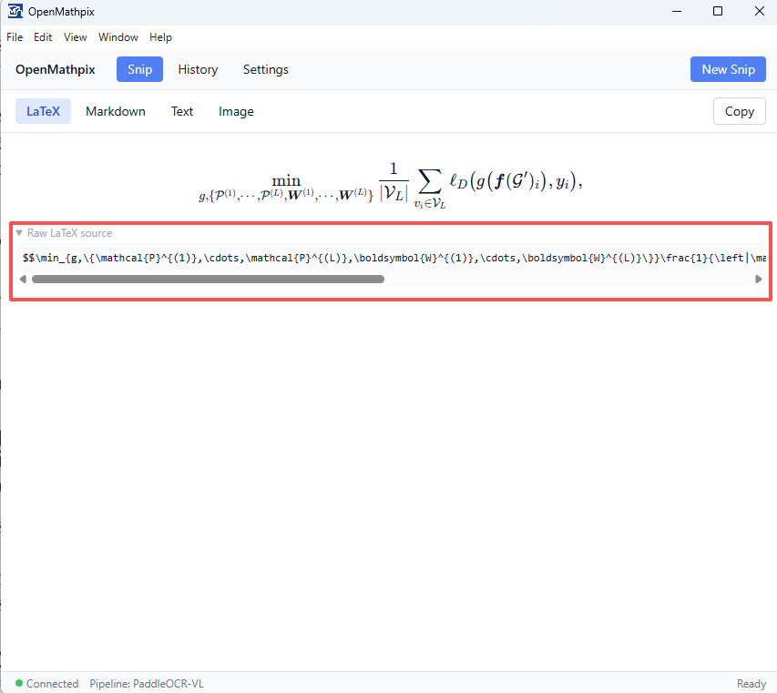

<p align="center">
  
</p>

<h1 align="center">OpenMathpix (增强版)</h1>

<p align="center">
  开源桌面截图工具，支持捕获屏幕区域并将数学公式、表格、文本转换为 LaTeX、Markdown 或纯文本 — 由百度 AIStudio 上的 <a href="https://github.com/PaddlePaddle/PaddleOCR">PaddleOCR</a> 提供动力。
</p>

---

## 增强特性

本项目在原版 OpenMathpix 的基础上进行了以下关键改进：
1. **支持 PaddleOCR API V2**：全面适配 V2 版本的异步轮询 `/jobs` 任务接口，支持最新的 **PaddleOCR-VL-1.6** 等主流多模态模型。
2. **解决剪贴板安全限制**：重构了复制逻辑，通过 Electron 主进程 IPC 写入剪贴板，彻底解决了由于窗口失去焦点导致的 `Cannot read properties of undefined (reading 'writeText')` 或 `Document is not focused` 报错。
3. **Markdown 图片 Base64 自动嵌入**：识别结果中的排版图片会自动下载并转换为 `Base64` 编码（`data:image/...;base64,...`）直接内嵌到 Markdown 的 `` 标签中，确保复制到 Typora、Obsidian 等笔记软件后，图片可以离线永久显示。

---

## 安装与编译

```bash
git clone git@github.com:JhuoW/OpenMathpix.git
cd OpenMathpix
npm install
npm run dev        
# 打包应用
npm run package    
```

---

## 快速上手

### 步骤 1：获取你的 API 凭证

1. 登录（或注册）免费的百度 AIStudio 账号：[https://aistudio.baidu.com/paddleocr](https://aistudio.baidu.com/paddleocr)。
2. 点击 **"API"** 按钮进入模型列表。选择你需要的模型（如 PaddleOCR-VL-1.6）查看示例代码，获取你专属的 **API 接口地址 (API URL)** 和 **访问令牌 (Access Token)**。

<div align="center">
  
</div>

3. 复制以下两个关键值：
   - **API 接口地址 (API URL)** — 例如 `https://xxxxxx.aistudio-app.com/layout-parsing`
   - **访问令牌 (Access Token)** — 你的身份认证 Token（也可以在 [这里](https://aistudio.baidu.com/index/accessToken) 获取）

> **注意：** 不同的模型使用不同的 API 接口地址（子域名不同）。切换模型时，请记得更新 API 接口地址。

### 步骤 2：配置 OpenMathpix

1. 启动 OpenMathpix。
2. 点击工具栏的 **Settings (设置)**。
3. 在 **API Configuration** 下：
   - 粘贴你的 **API URL**。
   - 粘贴你的 **Access Token**。
   - 选择与你在 AIStudio 上选择的相匹配的 **Pipeline**（模型通道）。
4. 点击 **Test Connection (测试连接)** 进行验证。

<div align="center">
  
</div>

### 步骤 3：截图与识别

#### 屏幕截图
你可以点击工具栏的 **Snip** 按钮，或者按快捷键，屏幕会变暗进入截图状态。

<div align="center">
  
</div>

拖动鼠标选择目标区域，松开鼠标即可自动捕获并开始识别。

<div align="center">
  
  
</div>

---

## 查看结果

识别完成后，结果会展示在以下四个标签页中：

| 标签页 | 说明 |
| :--- | :--- |
| **LaTeX** | 提取出的数学公式（支持 KaTeX 渲染），可直接复制 Raw 源码。 |
| **Markdown** | 结构化排版输出（支持标题、表格、行内与块公式，**图片已自动转为 Base64 内联**）。 |
| **Text** | 过滤所有格式后的纯文本。 |
| **Image** | 原始截取的图片预览。 |

点击 **Copy** 按钮复制当前选中的标签页内容。默认情况下，识别完成后会自动将默认格式复制到剪贴板。

---

## Pipelines (模型通道)

| Pipeline | 适用场景 | 输出格式 |
| :--- | :--- | :--- |
| **PP-OCRv5** | 常规文本识别（中英日韩等） | 纯文本 |
| **PP-StructureV3** | 数学公式、表格、版面分析与混合排版 | Markdown + LaTeX |
| **PaddleOCR-VL** | 视觉-语言大模型文档分析（基础版） | Markdown + LaTeX |
| **PaddleOCR-VL-1.5** | 高精度、印章及不规则文本识别 | Markdown + LaTeX |
| **PaddleOCR-VL-1.6** | 最新超强多模态版面分析（支持异步轮询） | Markdown + LaTeX |

> **注意：** 每一个 Pipeline 在 AIStudio 上都有独立的 API URL。切换 Pipeline 时，请务必同时更新设置中的 API URL。

---

## 快捷键

| 快捷键 | 动作 |
| :--- | :--- |
| `Ctrl+Shift+S` | 屏幕截图 (全局快捷键) |
| `Ctrl+V` | 粘贴图片并识别 |
| `Escape` | 取消截图 |

## 开源协议

MIT
